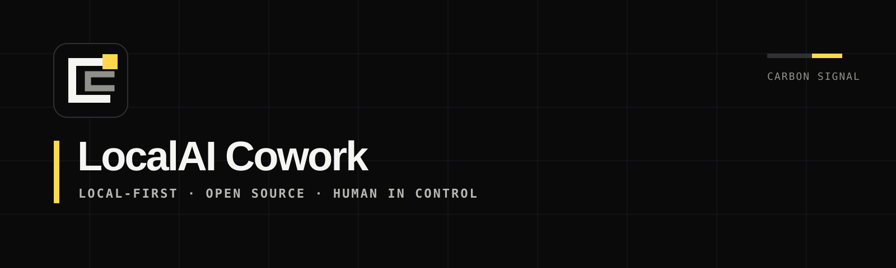
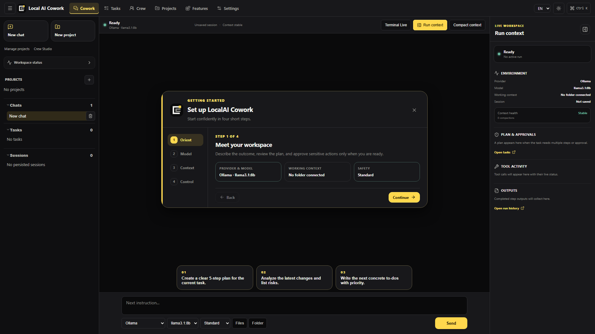

<p align="center">
  
</p>

# LocalAI Cowork

**The open-source, local-first AI coworker for Windows and Linux.** LocalAI Cowork combines tasks, files, local or hosted models, MCP tools, approvals, and reusable workflows in one inspectable desktop application.

It is an independent open-source alternative for people who like the outcome-driven approach of Claude Cowork and Microsoft Copilot Cowork, but want Ollama support, model choice, and source they can inspect and modify. It is early-stage software—not a claim of feature parity with either commercial product.

LocalAI Cowork is an independent project. It is not affiliated with or endorsed by Anthropic, Microsoft, or the separate [LocalAI](https://localai.io/) project.

[Website](https://noshitcoding.github.io/LocalAI-Cowork/) · [Download](https://github.com/noshitcoding/LocalAI-Cowork/releases/latest) · [Report a bug](https://github.com/noshitcoding/LocalAI-Cowork/issues/new?template=bug_report.yml) · [Request a feature](https://github.com/noshitcoding/LocalAI-Cowork/issues/new?template=feature_request.yml) · [Security](SECURITY.md)



## Why This Exists

Most AI work happens in separate browser tabs, terminals, file explorers, and local tools. LocalAI Cowork brings those pieces into a desktop app that can keep context, ask for approval before risky actions, and work with local or self-hosted model providers.

No LocalAI Cowork account is required. Use Ollama for local model execution or connect a compatible provider when a hosted model fits the task better.

The project is early. Windows is the most mature target, while Linux x86_64 is released as a beta-quality AppImage, DEB, and RPM. Start with non-sensitive copies of files and review AI-generated work before relying on it.

## Highlights

- Local desktop app built with Tauri, React, TypeScript, and Rust
- Chat workspace with persistent sessions, message history, and streaming output
- Local Ollama support with health checks, model selection, and configurable timeouts
- OpenAI-compatible and OpenRouter profile support
- MCP server management with probing and tool execution
- File and folder context for chat tasks
- Task lifecycle with approval states, progress, and audit events
- Skills, prompt templates, runtime instructions, and reusable workflows
- Terminal, process, memory, insight, and pipeline panels
- CDP developer browser with localhost preview, interaction, annotations, DOM,
  console, and network inspection
- GitHub workbench for local changes, branches, commits, pull requests, reviews,
  comments, and merges
- Gated Windows and Linux packages for tagged releases

## Current Scope

LocalAI Cowork is aimed at local and network-internal AI workflows. It is not a hosted SaaS and does not require a separate web server in normal desktop use.

The current implementation is strongest on Windows. Linux x86_64 packages are built and smoke-tested on Ubuntu 22.04 for a conservative glibc baseline. Windows-only features such as the native sandbox, OS credential vault integration, and Office automation are not yet available on Linux.

## Quick Start

### Prerequisites

- Windows 10 or Windows 11, or a modern x86_64 Linux desktop with WebKitGTK 4.1
- Node.js 22+
- npm 10+
- Rust via rustup
- Python 3.12.10 x64 when building the Windows offline runtime
- Python 3.10–3.13 on Linux when using Crew workflows
- Microsoft WebView2 Runtime on Windows
- Ollama, if you want local model execution

### Run The App In Development

```powershell
cd app
npm install
npm run tauri dev
```

### Build A Windows Installer

```powershell
cd app
npm run installer
```

Source builds create an offline CrewAI runtime from the reviewed, SHA-256-pinned
`requirements.lock`. Update that lock only intentionally with
`npm run prepare:crew-runtime -- -UpdateLock`, review the dependency diff, and
then rebuild the installer.

The packaged installer is written to:

```text
dist-installers/LocalAI-Cowork-Setup.exe
```

The original Tauri NSIS output remains under:

```text
app/src-tauri/target/release/bundle/nsis/
```

### Build Linux Packages

On a Linux host with the [Tauri Linux prerequisites](https://v2.tauri.app/start/prerequisites/) installed:

```bash
cd app
npm ci
npm run tauri build -- --bundles appimage,deb,rpm
```

The AppImage is the broadest cross-distribution option. Native DEB and RPM packages are also produced under `app/src-tauri/target/release/bundle/`. See [Linux installation](docs/LINUX_INSTALLATION.md) for supported formats, runtime requirements, and current limitations.

### Regenerate Brand Assets

The canonical Carbon Signal mark lives in `brand/open-workframe.svg`. Regenerate the web favicon, social preview, and all Tauri icon sizes from that master:

```powershell
cd app
npm run brand:assets
```

## Ollama Setup

LocalAI Cowork defaults to a local Ollama endpoint:

```text
http://localhost:11434
```

Example local model setup:

```powershell
ollama serve
ollama pull llama3.1:8b
```

You can change endpoint, model, timeout, context window, and temperature from the app settings.

## MCP Example

The repository includes a local DuckDuckGo web-search MCP server:

```text
Name: duckduckgo-websearch
Command: node
Args: scripts/mcp/duckduckgo-websearch-server.mjs
Tool: search_web
```

Common environment options:

- `DDG_MAX_RESULTS`, default `5`
- `DDG_REGION`, default `wt-wt`
- `DDG_SAFESEARCH`, default `moderate`
- `DDG_TIMEOUT_MS`, default `10000`

## Project Layout

```text
app/          Tauri desktop app, React frontend, Rust backend
docs/         Public user and integration documentation
scripts/      Repository-level validation helpers
.github/      CI, release automation, and community templates
site/         Public product website and search metadata
```

## Useful Commands

```powershell
cd app
npm run doctor
npm run lint
npm run typecheck
npm run test:ci
npm run build
```

Rust checks:

```powershell
cd app/src-tauri
cargo check
cargo test
cargo clippy -- -D warnings
```

Desktop smoke test:

```powershell
cd app
npm run smoke:desktop
```

## Documentation

- [Ollama configuration](docs/OLLAMA_CONFIGURATION.md)
- [Linux installation](docs/LINUX_INSTALLATION.md)
- [Desktop control and computer use](docs/DESKTOP_CONTROL_AND_COMPUTER_USE.md)
- [Developer browser and GitHub workbench](docs/DEVELOPER_BROWSER_AND_GITHUB.md)

## Release Workflow

The GitHub Actions workflow in `.github/workflows/release.yml` builds Windows x64 and Linux x64 packages, then publishes one GitHub Release only after every required job succeeds.

```powershell
git tag v0.2.0
git push origin v0.2.0
```

Release conditions are fail-closed: the tag must be valid `v`-prefixed SemVer, already exist, match the shared npm/Cargo/Tauri version, and point to a commit contained in `main`. Windows verification, Linux compilation and package smoke tests, vulnerability audits, updater signatures, and the `release` environment (including any configured protection rules) must all pass before publication. Stable tags cannot be manually marked as prereleases; prerelease tags use a SemVer suffix such as `v0.3.0-beta.1`.

The release includes a Windows NSIS installer plus Linux AppImage, DEB, and RPM packages. It also contains a cross-platform signed `latest.json`, CycloneDX SBOM, third-party notices, combined provenance, SHA-256 sums, and GitHub attestations. Update signing is mandatory and uses `LOCALAI_COWORK_UPDATER_PRIVATE_KEY` plus the optional `LOCALAI_COWORK_UPDATER_PRIVATE_KEY_PASSWORD`; keep the private key recoverable because installed apps trust it for future releases. Authenticode signing uses the `LOCALAI_COWORK_CODESIGN_*` secrets (with the legacy `OPEN_COWORK_*` names accepted during migration). Repositories that explicitly set `LOCALAI_COWORK_ALLOW_UNSIGNED_RELEASE=true` may publish an unsigned Windows installer only with a prominent warning asset and release notice; incomplete signing configuration still blocks publication.

## Contributing

Contributions are welcome while the project is still taking shape. Start with [CONTRIBUTING.md](CONTRIBUTING.md), run the local checks before opening a pull request, and keep changes focused.

## License And Disclaimer

LocalAI Cowork is licensed under the [Apache License, Version 2.0](LICENSE).

Attribution notices are provided in [NOTICE](NOTICE). Warranty and liability
limitations are included in Sections 7 and 8 of the Apache License, Version
2.0, with an additional plain-language summary in [DISCLAIMER.md](DISCLAIMER.md).
