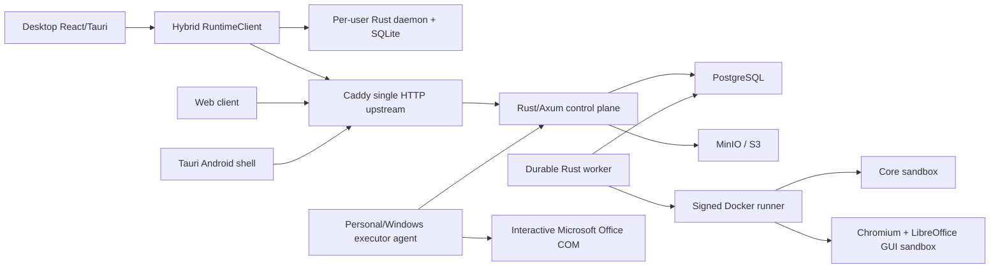

# Distributed, local-first Open Cowork architecture

Status: implementation foundation, protocol version 2 (accepting N-1 version 1), release line 0.3.x.

## Invariants enforced in code

- A run stores one immutable `ExecutorTarget`; there is no executor switch.
- Required capability names are compared before a device can claim a run.
- Only one non-terminal predecessor per thread can block the next run. Parallel
  work therefore requires another thread ID (a thread fork).
- Create is idempotent per user and idempotency key.
- Event sequence allocation is an atomic cursor on the run rather than a
  `MAX(sequence)` scan. Terminal-run events are purged after 90 days without
  permitting sequence reuse on any later administrative event.
- Executor work is bound to executor ID, a random lease token and an expiry.
  Expired unsafe work becomes `interrupted`; the worker never retries it by
  itself.
- Private local projects targeting a remote executor enter
  `waiting_for_snapshot` until an explicit snapshot is supplied.
- The desktop's personal target routes to the local client. Server Linux and
  Windows-pool targets route to the remote client. Closing a UI does not own or
  cancel either runtime.
- The Docker runner is the only Compose service with the Docker socket. Job
  containers are selected from an allowlist and are created non-root,
  read-only, capability-free, with no-new-privileges and CPU/RAM/PID/time/output
  limits. Network is `none` unless an operator configures a separately filtered
  egress network.
- GUI images bind their internal VNC-compatible capture listener to loopback.
  Compose publishes no VNC, RDP, WebRTC or TURN port.
- Managed Windows Office work accepts only relative paths inside a per-run
  workspace, disables Office automation security/macros, and never overwrites
  an existing output.

## Protocol surfaces

- REST: `/api/v1`
- Resumable event stream: `GET /api/v1/runs/{id}/events`, with
  `Last-Event-ID`
- External executor lease API: register, heartbeat, claim, event, complete and
  fail under `/api/v1/executors/{executorId}`
- Local daemon: newline-delimited JSON RPC over a per-user Named Pipe or Unix
  Domain Socket, protected by an atomically provisioned 256-bit local IPC token.
  A process lock enforces one worker per user; the signed desktop bundle installs
  a hash-verified versioned binary into stable per-user storage and registers
  user-login start without administrator rights
- Runner: internal `POST /v1/jobs`, protected by a 30-second HMAC signature and
  replay cache

Every wire object includes a schema version. Protocol v1 accepts schema v1;
capability names remain strings so a newer executor can advertise a feature to
an older control plane without breaking JSON decoding.

## Deliberate runtime boundaries

The Linux server does not host Ollama, vLLM or GPU infrastructure. Local devices
may bind model profile metadata to local Ollama/vLLM endpoints. Server workers
use only configured external OpenAI-compatible HTTP endpoints.

Web and Android receive no local bridge and therefore cannot inspect private
files, local paths, terminals or provider secrets. A private snapshot is an
explicit encrypted transfer object, not implicit file synchronization.
